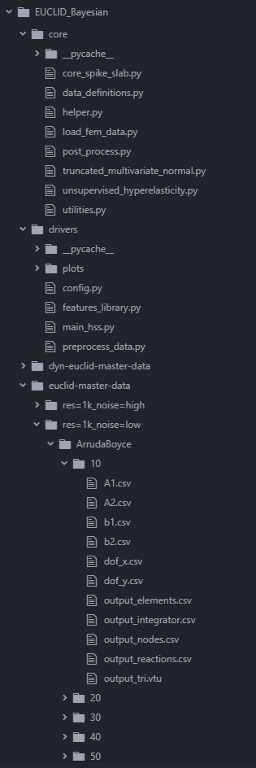
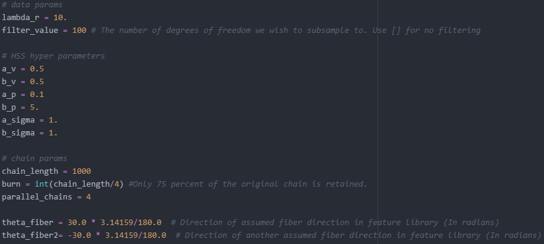
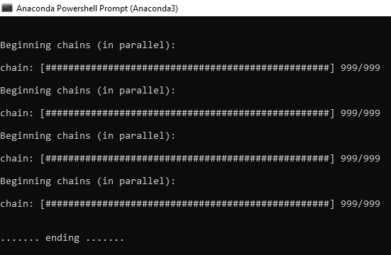
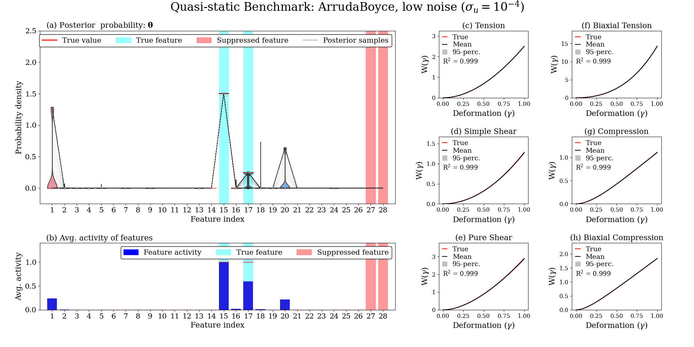

#Example for Arruda Boyce benchmark models

In the following, we illustrate the use of the Bayesian-EUCLID to discover the model of a known benchmark material (Arruda-Boyce model) using displacement field data obtained from FEM simulations.

##Input format

The benchmark FEM data folders- `dyn-euclid-master-data` (dynamic data) and `euclid-master-data` (quasistatic data) are structured as shown in the figure below

Additional benchmark materials can be added in the format shown above. The only difference between dynamic and quasistatic data is that the former also includes nodal acceleration data in the `output_nodes.csv` file.

##Parameters and code execution

The figure below shows a snippet of the `config.py` file, which contains the initialized parameters.

`lambda_r` is the regularization parameter that is used in `process_raw_data(...)` function in `unsupervised_hyperelasticity.py` file.

`filter_value` is the number of degrees of freedom subsampled from the available data at all quadrature points. In this case, at total of 100 degrees of freedom are subsampled from a total of 2752 data points.

`a_v, b_v, a_p, b_p, a_sigma` and `b_sigma` are the hierarchical spike slab hyperparameters shown in Fig. 2 in [the Bayesian-EUCLID paper](https://doi.org/10.1016/j.cma.2022.115225).

`chain_length` is the length of each individual Markov chain used to sample the posterior probability distribution. In this case a chain length of 1000 was used.

`burn` is the number of initial elements of each formed chain that are discarded. In this case the first 250 elements of each chain were discarded.

`parallel_chains` is the total number of chains used to sample the posterior probability distribution. A total of 4 chains were used in this work, which were later merged into a single chain of length 3000 elements, after the first 250 elements of each chain was discarded.

`theta_fiber` and `theta_fiber2` are the assumed orientation angles of the two fibers considered in the feature library. Two fibers suffice for the Holzapfel benchmark considered in this work. Also, as per the work by [Dong and Sun, (2021)](https://doi.org/10.1016/j.jmps.2021.104377), any symmetrical distribution of arbitrary number fibers can be equivalently resolved into a two-fiber system along the directions of symmetry. Appendix C of the [the Bayesian-EUCLID paper](https://doi.org/10.1016/j.cma.2022.115225) discusses the effect of assuming incorrect directions ($\pm45^{\circ}$) for the fibers.

The figures below show snippets of code execution in Anaconda Powershell Prompt. The `main_hss.py` file is run with the shown arguments. In the first case, the quasistatic Arruda-Boyce benchmark data is selected, while in the second the dynamic Arruda-Boyce benchmark data is selected.

The figure below shows a snippet of code progress as the chains are constructed and the energy plots are made.

##Code output

The main output of the code is the `chain` object whose `theta` attribute contains a distribution of the discovered feature coefficients. These discovered feature coefficients are used to make the violin plots and energy evolution plots as shown below.

